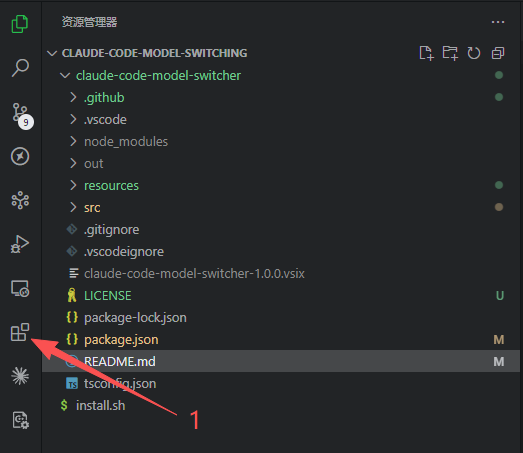
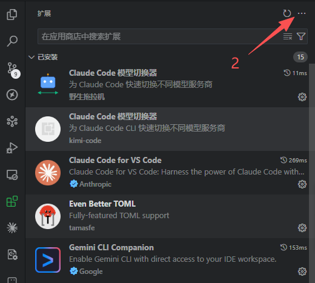
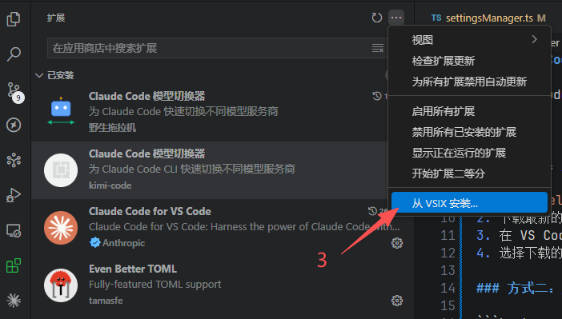
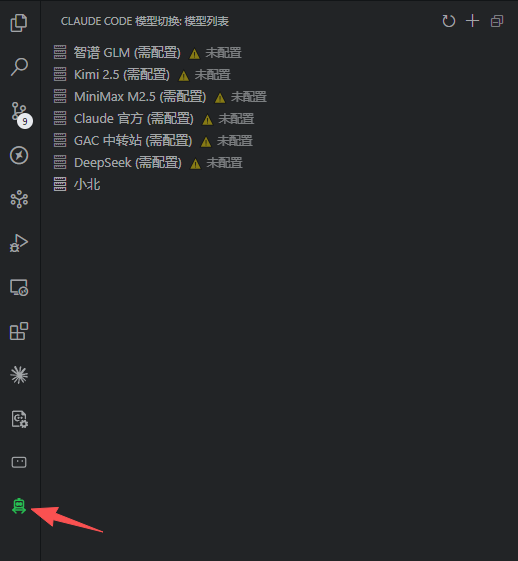
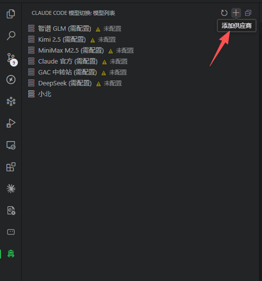
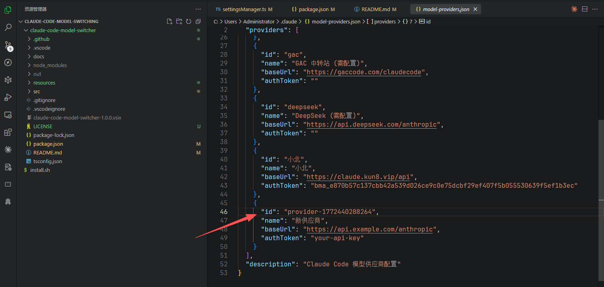
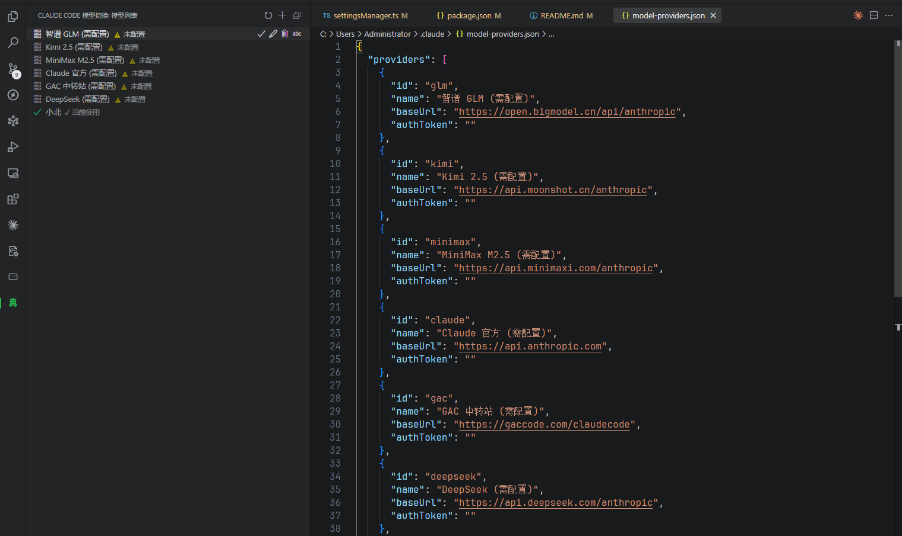
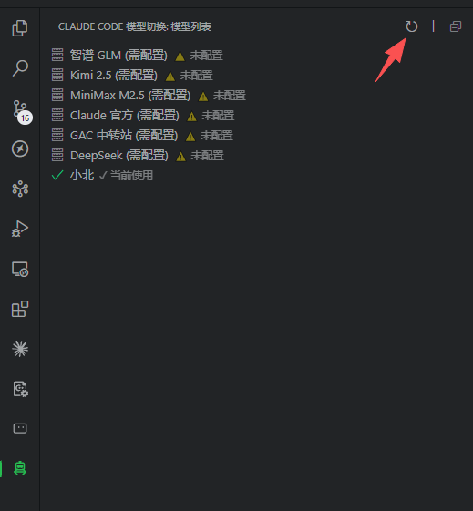

# Claude Code 模型切换器

让每个 Claude Code 项目使用不同的大模型。

## 安装

### 方式一：从 Release 下载（推荐）

1. 访问 [Releases 页面](https://github.com/tuolaji123/claude-code-model-switcher/releases)
2. 下载最新的 `.vsix` 文件
3. 在 VS Code 中安装：

   **步骤 1**：点击左侧活动栏的「扩展」图标（四个方块）
   
   

   **步骤 2**：点击右上角的「...」更多操作按钮
   
   

   **步骤 3**：选择「从 VSIX 安装...」，然后选择下载的 `.vsix` 文件
   
   

4. 安装完成后，左侧活动栏会出现机器人图标，点击即可使用

### 方式二：从源码构建

```bash
git clone https://github.com/tuolaji123/claude-code-model-switcher.git
cd claude-code-model-switcher
npm install
npm run compile
npx vsce package
# 然后在 VS Code 中安装生成的 .vsix 文件
```

## 工作原理

插件通过管理**全局供应商配置**和**项目级环境变量**来实现模型切换。

### 涉及文件

| 文件 | 位置 | 用途 |
|-----|------|------|
| `model-providers.json` | `~/.claude/model-providers.json` | **全局**供应商列表（只需配置一次）|
| `settings.json` | `.claude/settings.json` | **项目级** Claude Code 配置（自动更新）|

### 配置分离设计

- **全局配置**（`~/.claude/model-providers.json`）：存储所有供应商的 API Key，只需配置一次，所有项目共用
- **项目配置**（`.claude/settings.json`）：存储当前项目使用的模型环境变量

### model-providers.json 格式

```json
{
  "providers": [
    {
      "id": "glm",
      "name": "智谱 GLM",
      "baseUrl": "https://open.bigmodel.cn/api/anthropic",
      "authToken": "your-api-key-here",
      "model": "",
      "smallFastModel": ""
    },
    {
      "id": "custom",
      "name": "自定义供应商",
      "baseUrl": "https://api.example.com/v1",
      "authToken": "your-api-key",
      "model": "",
      "smallFastModel": ""
    }
  ]
}
```

字段说明：

| 字段 | 说明 |
|------|------|
| `id` | 供应商唯一标识 |
| `name` | 显示名称 |
| `baseUrl` | API 接口地址 |
| `authToken` | API Key |
| `model` | 主模型 ID（可选，默认空）。例如 OpenRouter 的 `~anthropic/claude-fable-latest` |
| `smallFastModel` | 轻量/快速任务模型 ID（可选，默认空）。例如 OpenRouter 的 `~anthropic/claude-haiku-latest` |

`model` 和 `smallFastModel` 为空时，切换供应商后不会向 `settings.json` 写入 `ANTHROPIC_MODEL` / `ANTHROPIC_SMALL_FAST_MODEL`，适合 Kimi、GLM 等不需要指定模型 ID 的供应商。

### settings.json 自动更新

切换模型时，插件自动修改项目目录下的配置：

```json
{
  "env": {
    "ANTHROPIC_BASE_URL": "https://open.bigmodel.cn/api/anthropic",
    "ANTHROPIC_AUTH_TOKEN": "your-api-key-here"
  }
}
```

## 使用方法

### 1. 添加和配置大模型

**步骤 1**：点击左侧活动栏的机器人图标，打开模型切换面板



**步骤 2**：点击右上角的 `+`（添加供应商）按钮



**步骤 3**：在打开的 `~/.claude/model-providers.json` 文件中，填写你的 API 信息

- `baseUrl`：API 接口地址
- `authToken`：你的 API Key




**快捷配置方式**：点击任何显示「⚠ 未配置」的模型选项，会自动打开配置文件并定位到该模型的位置，只需填入 `authToken` 即可



**刷新列表**：添加或修改配置后，点击面板右上角的刷新按钮 🔄，列表会自动更新配置状态



### 2. 为项目选择模型

**直接点击**列表中已配置authToken的供应商即完成切换：


- ✓ 自动更新当前项目的 `.claude/settings.json`
- 当前使用的供应商显示 **✓ 当前使用** 标记
- **无需重启 VS Code**，切换立即生效

**重要提示**：
- 切换配置后，即使**不使用 IDE，直接在终端运行 `claude` 命令**，也会使用新切换的模型
- 因为配置是写入项目目录的 `.claude/settings.json`，Claude Code CLI 会读取这个配置

### 3. 管理供应商

**快捷操作（悬停图标）**：
鼠标悬停在供应商上时，会显示操作图标：
- ✏️ **重命名**：点击铅笔图标快速修改名称
- 🗑️ **删除**：点击垃圾桶图标删除该供应商

**完整编辑（JSON 文件）**：
如需修改 `baseUrl` 或 `authToken`，点击 `编辑配置文件` 按钮打开 `~/.claude/model-providers.json`，直接编辑对应字段：
- 修改 `name`：显示名称
- 修改 `baseUrl`：API 接口地址
- 修改 `authToken`：API Key
- 删除：删除整个供应商对象

保存 JSON 文件后，点击面板右上角的刷新按钮 🔄 即可看到更新后的列表

## 支持的供应商

任何兼容 Anthropic API 格式的服务商：

| 服务商 | Base URL 示例 |
|-------|--------------|
| 智谱 GLM | `https://open.bigmodel.cn/api/anthropic` |
| 其他 | 填写对应的 API key |

## 注意事项

1. **全局配置安全**：`~/.claude/model-providers.json` 包含敏感信息，注意保护好你的主目录
2. **项目独立**：每个项目可以选择不同的模型，通过 `.claude/settings.json` 区分
3. **实时刷新**：编辑全局配置保存后，所有项目的面板都会自动刷新
4. **重启生效**：切换模型后需要重启 Claude Code

---

**开发者**：野生拖拉机
